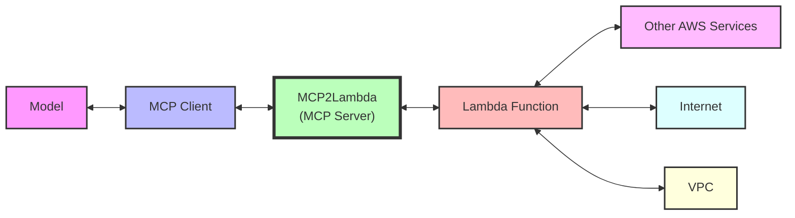

# MCP2Lambda

[](https://smithery.ai/server/@danilop/MCP2Lambda)

<a href="https://glama.ai/mcp/servers/4hokv207sz">
  
</a>

Run any [AWS Lambda](https://aws.amazon.com/lambda/) function as a Large Language Model (LLM) **tool** without code changes using [Anthropic](https://www.anthropic.com)'s [Model Context Protocol (MCP)](https://github.com/modelcontextprotocol).



This MCP server acts as a **bridge** between MCP clients and AWS Lambda functions, allowing generative AI models to access and run Lambda functions as tools. This is useful, for example, to access private resources such as internal applications and databases without the need to provide public network access. This approach allows the model to use other AWS services, private networks, and the public internet.

From a **security** perspective, this approach implements segregation of duties by allowing the model to invoke the Lambda functions but not to access the other AWS services directly. The client only needs AWS credentials to invoke the Lambda functions. The Lambda functions can then interact with other AWS services (using the function role) and access public or private networks.

The MCP server gives access to two tools:

1. The first tool can **autodiscover** all Lambda functions in your account that match a prefix or an allowed list of names. This tool shares the names of the functions and their descriptions with the model.

2. The second tool allows to **invoke** those Lambda functions by name passing the required parameters.

No code changes are required. You should change these configurations to improve results:

## Strategy Selection

The gateway supports two different strategies for handling Lambda functions:

1. **Pre-Discovery Mode** (default: enabled): Registers each Lambda function as an individual tool at startup. This provides a more intuitive interface where each function appears as its own named tool.

2. **Generic Mode**: Uses two generic tools (`list_lambda_functions` and `invoke_lambda_function`) to interact with Lambda functions.

You can control this behavior through:

- Environment variable: `PRE_DISCOVERY=true|false`
- CLI flag: `--no-pre-discovery` (disables pre-discovery mode)

Example:
```bash
# Disable pre-discovery mode
export PRE_DISCOVERY=false
python main.py

# Or using CLI flag to disable pre-discovery
python main.py --no-pre-discovery
```

1. To provide the MCP client with the knowledge to use a Lambda function, the **description of the Lambda function** should indicate what the function does and which parameters it uses. See the sample functions for a quick demo and more details.

2. To help the model use the tools available via AWS Lambda, you can add something like this to your **system prompt**:

```
Use the AWS Lambda tools to improve your answers.
```

## Overview

MCP2Lambda enables LLMs to interact with AWS Lambda functions as tools, extending their capabilities beyond text generation. This allows models to:

- Access real-time and private data, including data sources in your VPCs
- Execute custom code using a Lambda function as sandbox environment
- Interact with external services and APIs using Lambda functions internet access (and bandwidth)
- Perform specialized calculations or data processing

The server uses the MCP protocol, which standardizes the way AI models can access external tools.

By default, only functions whose name starts with `mcp2lambda-` will be available to the model.

## Prerequisites

- Python 3.12 or higher
- AWS account with configured credentials
- AWS Lambda functions (sample functions provided in the repo)
- An application using [Amazon Bedrock](https://aws.amazon.com/bedrock/) with the [Converse API](https://docs.aws.amazon.com/bedrock/latest/userguide/converse.html)
- An MCP-compatible client like [Claude Desktop](https://docs.anthropic.com/en/docs/claude-desktop)

## Installation

### Installing via Smithery

To install MCP2Lambda for Claude Desktop automatically via [Smithery](https://smithery.ai/server/@danilop/MCP2Lambda):

```bash
npx -y @smithery/cli install @danilop/MCP2Lambda --client claude
```

### Manual Installation
1. Clone the repository:
   ```
   git clone https://github.com/yourusername/mcp2lambda.git
   cd mcp2lambda
   ```

2. Configure AWS credentials. For example, using the [AWS CLI](https://aws.amazon.com/cli):
   ```
   aws configure
   ```

## Sample Lambda Functions

This repository includes three *sample* Lambda functions that demonstrate different use cases. These functions have basic permissions and can only write to CloudWatch logs.

### CustomerIdFromEmail
Retrieves a customer ID based on an email address. This function takes an email parameter and returns the associated customer ID, demonstrating how to build simple lookup tools. The function is hard coded to reply to the `user@example.com` email address. For example, you can ask the model to get the customer ID for the email `user@example.com`.

### CustomerInfoFromId
Retrieves detailed customer information based on a customer ID. This function returns customer details like name, email, and status, showing how Lambda can provide context-specific data. The function is hard coded to reply to the customer ID returned by the previous function. For example, you can ask the model to "Get the customer status for email `user@example.com`". This will use both functions to get to the result.

### RunPythonCode
Executes arbitrary Python code within a Lambda sandbox environment. This powerful function allows Claude to write and run Python code to perform calculations, data processing, or other operations not built into the model. For example, you can ask the model to "Calculate the number of prime numbers between 1 and 10, 1 and 100, and so on up to 1M".

## Deploying Sample Lambda Functions

The repository includes sample Lambda functions in the `sample_functions` directory.

1. Install the AWS SAM CLI: https://docs.aws.amazon.com/serverless-application-model/latest/developerguide/install-sam-cli.html

2. Deploy the sample functions:
   ```
   cd sample_functions
   sam build
   sam deploy
   ```

The sample functions will be deployed with the prefix `mcp2lambda-`.

## Using with Amazon Bedrock

MCP2Lambda can also be used with Amazon Bedrock's Converse API, allowing you to use the MCP protocol with any of the models supported by Bedrock.

The `mcp_client_bedrock` directory contains a client implementation that connects MCP2Lambda to Amazon Bedrock models.

See https://github.com/mikegc-aws/amazon-bedrock-mcp for more information.

### Prerequisites

- Amazon Bedrock access and permissions to use models like Claude, Mistral, Llama, etc.
- Boto3 configured with appropriate credentials

### Installation and Setup

1. Navigate to the mcp_client_bedrock directory:
   ```
   cd mcp_client_bedrock
   ```

2. Install dependencies:
   ```
   uv pip install -e .
   ```

3. Run the client:
   ```
   python main.py
   ```

### Configuration

The client is configured to use Anthropic's Claude 3.7 Sonnet by default, but you can modify the `model_id` in `main.py` to use other Bedrock models:

```python
# Examples of supported models:
model_id = "us.anthropic.claude-3-7-sonnet-20250219-v1:0"
#model_id = "us.amazon.nova-pro-v1:0"
```

You can also customize the system prompt in the same file to change how the model behaves.

### Usage

1. Start the MCP2Lambda server in one terminal:
   ```
   cd mcp2lambda
   uv run main.py
   ```

2. Run the Bedrock client in another terminal:
   ```
   cd mcp_client_bedrock
   python main.py
   ```

3. Interact with the model through the command-line interface. The model will have access to the Lambda functions deployed earlier.

## Using with Claude Desktop

Add the following to your Claude Desktop configuration file:

```json
{
  "mcpServers": {
    "mcp2lambda": {
      "command": "uv",
      "args": [
        "--directory",
        "<full path to the mcp2lambda directory>",
        "run",
        "main.py"
      ]
    }
  }
}
```

To help the model use tools via AWS Lambda, in your settings profile, you can add to your personal preferences a sentence like:

```
Use the AWS Lambda tools to improve your answers.
```

## Starting the MCP Server

Start the MCP server locally:

```sh
cd mcp2lambda
uv run main.py
```